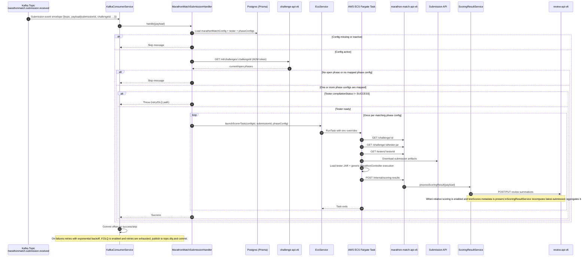

# marathon-match-api-v6

NestJS service for managing marathon match scorer configuration, compiling tester JARs, consuming submission events from Kafka, and launching ECS scoring tasks.

## Service base path

All HTTP endpoints are exposed under:

`/v6/marathon-match`

Swagger UI:

`/v6/marathon-match/api-docs`

## Documentation

- [Marathon Match Setup](docs/marathon-match-setup.md) - for challenge administrators
- [Submission Phase Scoring](docs/submission-phase-scoring.md) - for DevOps
- [Review Phase Scoring](docs/review-phase-scoring.md) - for DevOps
- [Full Marathon Match Test Script](docs/full-marathon-match-test.md) - for end-to-end smoke tests with production baseline fixtures

## Configuration values

The service is configured via environment variables.

### Core service and database

| Variable | Required | Default | Used for |
| --- | --- | --- | --- |
| `PORT` | No | `3000` | HTTP listen port |
| `NODE_ENV` | No | (unset) | Token-expiration behavior and Prisma logging behavior |
| `CORS_ALLOWED_ORIGIN` | No | Built-in localhost/topcoder regex list | CORS origin matching |
| `DATABASE_URL` | Yes | None | Prisma + pg-boss Postgres connection |
| `POSTGRES_SCHEMA` | No | `public` | Prisma schema name used in runtime logging/connection context |
| `MM_SERVICE_PRISMA_TIMEOUT` | No | `10000` | Prisma transaction timeout (ms) |

### JWT auth and M2M auth

| Variable | Required | Default | Used for |
| --- | --- | --- | --- |
| `AUTH_SECRET` | Yes (for JWT validation) | None | tc-core JWT authenticator secret |
| `VALID_ISSUERS` | No | Topcoder/Auth0 issuer JSON array string | Accepted JWT issuers |
| `AUTH0_ISSUER` | No | `https://topcoder-dev.auth0.com/` | Legacy JWT config field |
| `TOKEN_AUDIENCE` | No | `https://m2m.topcoder-dev.com/` | Legacy JWT config field |
| `AUTH0_URL` | No | `http://localhost:4000/oauth/token` | M2M token endpoint |
| `AUTH0_DOMAIN` | No | `topcoder-dev.auth0.com` | M2M config metadata |
| `AUTH0_AUDIENCE` | No | `https://m2m.topcoder-dev.com/` | M2M audience |
| `AUTH0_PROXY_SERVER_URL` | No | (unset) | Optional M2M proxy |
| `AUTH0_CLIENT_ID` | Yes (for outbound API calls) | None | M2M client ID |
| `AUTH0_CLIENT_SECRET` | Yes (for outbound API calls) | None | M2M client secret |

### Kafka consumer/producer

| Variable | Required | Default | Used for |
| --- | --- | --- | --- |
| `DISABLE_KAFKA` | No | `false` | Fully disable Kafka connection/consumption |
| `KAFKA_URL` | No | `localhost:9092` | Broker list (comma-separated). If unset, `KAFKA_BROKERS` is also accepted |
| `KAFKA_BROKERS` | No | (fallback only) | Alternative broker list env key (review-api compatibility) |
| `KAFKA_CLIENT_ID` | No | `tc-marathon-match-api` | Kafka client ID |
| `KAFKA_GROUP_ID` | No | `tc-marathon-match-consumer-group` | Consumer group ID |
| `KAFKA_SSL_ENABLED` | No | `false` | Enable TLS |
| `KAFKA_SASL_MECHANISM` | No | `plain` | SASL mechanism (`plain`, `scram-sha-256`, `scram-sha-512`) |
| `KAFKA_SASL_USERNAME` | No | (unset) | SASL username (enables SASL when set) |
| `KAFKA_SASL_PASSWORD` | No | empty string | SASL password |
| `KAFKA_CONNECTION_TIMEOUT` | No | `10000` | Kafka connect timeout (ms) |
| `KAFKA_REQUEST_TIMEOUT` | No | `30000` | Kafka request timeout (ms) |
| `KAFKA_MAXBYTES` / `KAFKA_MAX_BYTES` | No | Kafka client default | Consumer fetch max bytes (dev parity with review-api usage) |
| `KAFKA_MIN_BYTES` | No | Kafka client default | Consumer fetch minimum bytes |
| `KAFKA_MAX_WAIT_TIME` | No | Auto-derived from request timeout | Consumer fetch max wait (ms) |
| `KAFKA_RETRY_ATTEMPTS` | No | `5` | Client reconnection retry count |
| `KAFKA_INITIAL_RETRY_TIME` | No | `100` | Initial retry delay (ms) |
| `KAFKA_MAX_RETRY_TIME` | No | `30000` | Max exponential retry delay (ms) |
| `KAFKA_DLQ_ENABLED` | No | `false` | Enable DLQ publishing after retry exhaustion |
| `KAFKA_DLQ_TOPIC_SUFFIX` | No | `.dlq` | DLQ topic suffix |
| `KAFKA_DLQ_MAX_RETRIES` | No | `3` | Per-message retries before DLQ |

### Marathon scoring integration

| Variable | Required | Default | Used for |
| --- | --- | --- | --- |
| `CHALLENGE_API_URL` | No | `https://api.topcoder-dev.com` | Challenge API lookup for current active phase |
| `RESOURCES_API_URL` | No | `${CHALLENGE_API_URL}/v6/resources` | Resource API lookup for challenge-specific copilot access to manual reruns |
| `DISABLE_PG_BOSS` | No | `false` | Disable pg-boss queue/worker and run tester compilation inline |
| `DEFAULT_REVIEW_SCORECARD_ID` | Yes (for UI defaults) | None | Default review scorecard returned by `GET /challenge/defaults` |
| `DEFAULT_TEST_TIMEOUT_MS` | No | `90000` | Default test timeout returned by `GET /challenge/defaults` |
| `DEFAULT_COMPILE_TIMEOUT_MS` | No | `120000` | Default compile timeout returned by `GET /challenge/defaults` |
| `DEFAULT_TASK_DEFINITION_NAME` | No | empty string | Default ECS task definition family returned by `GET /challenge/defaults` |
| `DEFAULT_TASK_DEFINITION_VERSION` | No | empty string | Default ECS task definition revision returned by `GET /challenge/defaults` |
| `COMPILE_TIMEOUT_MS` | No | `120000` | Maven tester compilation timeout |
| `COMPILE_JAVA_MAX_HEAP_MB` | No | `384` | Max JVM heap (MB) enforced for tester compilation Maven process when `-Xmx` is not already provided |
| `COMPILE_MAVEN_OPTS` | No | (auto-derived) | Compile-worker specific `MAVEN_OPTS`; if unset, falls back to `MAVEN_OPTS` and auto-appends `-Xmx` cap |
| `MVN_BINARY` | No | `mvn` | Maven executable for tester compilation |
| `BOILERPLATE_DIR` | No | `<repo>/ecs-runner/boilerplate` | Java boilerplate project copied for compilation |
| `COMPILATION_TMP_DIR` | No | Auto-discovery (`TMPDIR`, `/dev/shm` on Linux, `os.tmpdir()`, `<repo>/tmp`) | Writable temp root used for compile workspaces; set to `/dev/shm` to keep workspace on memory-backed tmpfs |
| `PG_BOSS_COMPILE_TEAM_SIZE` | No | `1` | Number of pg-boss compile workers processing jobs in parallel |
| `PG_BOSS_COMPILE_TEAM_CONCURRENCY` | No | `1` | Per-worker concurrency for compile jobs |

### ECS launch configuration

| Variable | Required | Default | Used for |
| --- | --- | --- | --- |
| `AWS_REGION` | No | `us-east-1` | AWS SDK ECS client region |
| `ECS_CLUSTER` | Yes (for scoring) | None | ECS cluster for `RunTask` |
| `ECS_SUBNETS` | Yes (for scoring) | None | Comma-separated subnets for awsvpc task networking |
| `ECS_SECURITY_GROUPS` | Yes (for scoring) | None | Comma-separated security groups for awsvpc networking |
| `ECS_CONTAINER_NAME` | Yes (for scoring) | None | Container override target in task definition |
| `MARATHON_MATCH_API_URL` | Yes (for scoring) | None | Base URL passed to ECS runner |
| `REVIEW_API_URL` | Yes (for scoring) | None | Review API base URL used by NestJS scoring callback processor |
| `REVIEW_TYPE_ID` | Yes (for scoring) | None | Review type ID passed to ECS runner callback payload |
| `DEBUG_LOG_ACCESS_TOKEN` | No | `false` | Pass-through to ECS runner for access-token debug logging (redacted token + decoded JWT header/payload) |
| `DEBUG_LOG_FULL_ACCESS_TOKEN` | No | `false` | Pass-through to ECS runner to print full `ACCESS_TOKEN` when `DEBUG_LOG_ACCESS_TOKEN=true` |

`launchScorerTask(...)` already disables public IP assignment for scorer tasks. Use dedicated scorer security groups with least-privilege egress for the trusted bootstrap/callback traffic that remains on the parent runner process.

### ECS runner task environment (injected at launch)

These are required by `ecs-runner` and are passed in container overrides when a task is launched:

- `TESTER_CONFIG_ID` (contains the challenge ID used by `/challenge/:challengeId` endpoints)
- `SUBMISSION_ID`
- `ACCESS_TOKEN`
- `MARATHON_MATCH_API_URL`
- `REVIEW_TYPE_ID`
- `TEST_PHASE`
- `PHASE_CONFIG_TYPE`
- `PHASE_START_SEED`
- `PHASE_NUMBER_OF_TESTS`
- `REVIEW_ID` (optional; used for SYSTEM review completion callbacks)

Optional debug vars (set on API service env to be forwarded to runner):

- `DEBUG_LOG_ACCESS_TOKEN`
- `DEBUG_LOG_FULL_ACCESS_TOKEN` (prints full bearer token; use only for short-lived debugging)

### Submission isolation inside the ECS runner

The ECS task still needs trusted outbound access to fetch challenge config, download submission artifacts, upload artifacts, and post the scoring callback. Untrusted tester/submission execution is therefore split from that bootstrap logic inside the container:

- The container starts as `root` and must not have its ECS task-definition `user` overridden.
- The trusted parent runner holds `ACCESS_TOKEN`, performs network calls, and never loads untrusted submission code directly.
- The parent launches a separate child JVM as the `runner` user with a scrubbed environment, so submission processes do not inherit the bearer token or other runner env vars.
- A native wrapper blocks creation of non-`AF_UNIX` sockets for that child JVM and all descendant submission processes, so submissions cannot open live outbound network connections.
- Standard Topcoder Marathon testers run through the generic runner flow, which creates the callback score payload from trusted runner code. Custom tester `runTester(...)` result maps remain supported for advanced cases.

## Exit code 137 (OOM) mitigation

`137` usually means the process was killed by the container runtime due to memory pressure.
For development environments with tight memory limits, use these settings first:

```bash
COMPILE_JAVA_MAX_HEAP_MB=256
COMPILE_MAVEN_OPTS="-Xms128m -Xmx256m"
PG_BOSS_COMPILE_TEAM_SIZE=1
PG_BOSS_COMPILE_TEAM_CONCURRENCY=1
```

If you are not actively consuming submission events or async compile queues in a dev smoke test, also disable background workers:

```bash
DISABLE_KAFKA=true
DISABLE_PG_BOSS=true
```

## Endpoints and auth

All secured endpoints require `Authorization: Bearer <token>`.

Auth model in code:

- User JWT with role `administrator` passes role checks.
- User JWT with role `copilot` also passes the scorer/tester setup routes used by platform-ui.
- M2M JWT passes with required scope.
- `all:marathon-match` and `all:marathon-match-tester` are expanded to their CRUD scopes.

### Public endpoints

| Method | Path | Auth | Notes |
| --- | --- | --- | --- |
| `GET` | `/v6/marathon-match/health` | None | DB health check |
| `GET` | `/v6/marathon-match/api-docs` | None | Swagger docs route |

### Tester endpoints

| Method | Path | Required role/scope |
| --- | --- | --- |
| `POST` | `/v6/marathon-match/testers` | `administrator` OR `copilot` OR `create:marathon-match-tester` |
| `GET` | `/v6/marathon-match/testers` | `administrator` OR `copilot` OR `read:marathon-match-tester` |
| `GET` | `/v6/marathon-match/testers/:id` | `administrator` OR `copilot` OR `read:marathon-match-tester` |
| `PUT` | `/v6/marathon-match/testers/:id` | `administrator` OR `copilot` OR `update:marathon-match-tester` |
| `DELETE` | `/v6/marathon-match/testers/:id` | `administrator` OR `delete:marathon-match-tester` |

`POST /v6/marathon-match/testers` creates only the first record in a tester family and rejects names that already exist. `GET /v6/marathon-match/testers` returns tester summary rows only. `GET /v6/marathon-match/testers/:id` returns tester details with `sourceCode`. `PUT /v6/marathon-match/testers/:id` creates a new tester version while preserving older versions for lookup and selection. Detail and version-create responses omit `jarFile` by default; add `?includeJarFile=true` only when you explicitly need the compiled jar payload.

### Marathon match config endpoints

| Method | Path | Required role/scope |
| --- | --- | --- |
| `POST` | `/v6/marathon-match/challenge/:challengeId` | `administrator` OR `copilot` OR `create:marathon-match` |
| `GET` | `/v6/marathon-match/challenge` | `administrator` OR `read:marathon-match` |
| `GET` | `/v6/marathon-match/challenge/defaults` | `administrator` OR `copilot` OR `read:marathon-match` |
| `GET` | `/v6/marathon-match/challenge/:challengeId` | `administrator` OR `copilot` OR `read:marathon-match` |
| `GET` | `/v6/marathon-match/challenge/:challengeId/tester-jar` | `administrator` OR `read:marathon-match` |
| `PUT` | `/v6/marathon-match/challenge/:challengeId` | `administrator` OR `copilot` OR `update:marathon-match` |
| `DELETE` | `/v6/marathon-match/challenge/:challengeId` | `administrator` OR `delete:marathon-match` |

### Submission runner log endpoint

| Method | Path | Required role/scope |
| --- | --- | --- |
| `GET` | `/v6/marathon-match/submissions/:submissionId/runner-logs` | `administrator` OR `copilot` OR `Manager` OR `read:marathon-match` |

### Internal scoring callback endpoint

| Method | Path | Required role/scope |
| --- | --- | --- |
| `POST` | `/v6/marathon-match/internal/scoring-results` | `administrator` OR `update:marathon-match` |
| `POST` | `/v6/marathon-match/internal/system-score` | `administrator` OR `update:marathon-match` |

`POST /v6/marathon-match/internal/scoring-results` rejects callbacks whose `challengeId` does not map to an existing Marathon Match config.

## How to set up a challenge for marathon match scoring

For the full operator guide, see [Marathon Match Setup](docs/marathon-match-setup.md). The steps below remain as a quick reference.

### 1. Create a tester

Create a tester (`POST /testers`) with:

- `name`
- `version`
- `className` (fully-qualified Java Marathon tester class)
- `sourceCode`

`POST /testers` is only for a brand-new tester name. If that tester family already exists, use `PUT /testers/:id` and a higher `version` instead.

Compilation is async through pg-boss. The create/version-create endpoint returns before compilation finishes and includes the tester record you should poll for compilation status.

### 2. Wait for compilation success

Poll `GET /testers/:id` until:

- `compilationStatus = SUCCESS`

If you need the compiled jar in the response, call `GET /testers/:id?includeJarFile=true` after compilation succeeds.

If `compilationStatus = FAILED`, publish a higher tester version via `PUT /testers/:id`.

### 3. Create challenge config

Create config on the challenge id (`POST /challenge/:challengeId`) and include at minimum:

- `testerId` (from step 1)
- `reviewScorecardId`
- `relativeScoringEnabled` (`true` to normalize scores against the latest submission per member; defaults to `true`)
- `scoreDirection` (`MAXIMIZE` when higher raw testcase scores are better, `MINIMIZE` when lower scores are better)
- `submissionApiUrl`
- `taskDefinitionName`
- `taskDefinitionVersion`
- `active` (`true` to enable scoring)
- phase mappings (`example`, `provisional`, `system`) with:
  - `phaseId` (from challenge-api `phases[].phaseId`, not the challenge-phase row `id`)
  - `startSeed`
  - `numberOfTests`

Config identity semantics:

- `id` is an internal nano-id for the marathon match config record.
- `challengeId` stores the challenge identifier and is used for `/challenge/:challengeId` CRUD endpoints.
- `POST /challenge/:challengeId` validates that the challenge exists in challenge-api and that `reviewScorecardId` resolves in review-api before persisting. If a config already exists for the challenge, the API returns `409 Conflict`.
- `phaseConfig.phaseId` stores the canonical challenge phase definition id from challenge-api `phases[].phaseId`. Create/update requests also accept the challenge-phase row `id` and normalize it before persistence for backwards compatibility.
- `reviewScorecardId` can be either the current review-api scorecard id or a legacy id; scoring callback processing resolves it to the canonical scorecard id before posting review summations.
- When `relativeScoringEnabled = true`, review scores are recomputed from per-test raw scores against the best score currently held by the latest submission from each member, so final review summation scores stay within `0..100` and can change as new submissions arrive.

Important runtime behavior:

- Incoming submission events are only processed when config is `active = true`.
- The handler resolves currently open challenge phases from challenge-api (`phases[].isOpen = true`) and matches stored phase config rows by the canonical challenge `phaseId`. Legacy stored challenge-phase row ids are also recognized for backwards compatibility.
- If no matching phase config exists, the submission is skipped.
- If multiple phase configs match the currently open challenge phases, the handler launches one scorer task per match. This allows `EXAMPLE` and `PROVISIONAL` scoring to run from the same Submission phase when both configs point at that phase.

### 4. Ensure scorer infrastructure is configured

Before live scoring, verify:

- Kafka topic `marathonmatch.submission.received` is receiving events.
- Service can fetch M2M token (`AUTH0_CLIENT_ID`/`AUTH0_CLIENT_SECRET`).
- ECS env vars are set (`ECS_CLUSTER`, `ECS_SUBNETS`, `ECS_SECURITY_GROUPS`, `ECS_CONTAINER_NAME`, `MARATHON_MATCH_API_URL`, `REVIEW_API_URL`, `REVIEW_TYPE_ID`).
- Task definition referenced by `taskDefinitionName:taskDefinitionVersion` exists and contains the configured container name.

### 5. Optional verification calls

- `GET /challenge/:challengeId` to verify stored config and phase mappings.
- `GET /challenge/:challengeId/tester-jar` to verify compiled jar retrieval.

## ECS runner image (ECR)

The scorer task launched by `EcsService` must reference an ECR image built from:

- `ecs-runner/Dockerfile`

Recommended publish flow:

```bash
AWS_REGION=us-east-1 ECR_REPOSITORY=mm-ecs-runner ./ecs-runner/scripts/build-and-push-ecr.sh
```

Detailed runner image and tagging guidance:

- `ecs-runner/README.md`

## Submission scoring flow (Kafka to score)



SYSTEM review scoring uses the same scorer pipeline after autopilot dispatches:

- `POST /v6/marathon-match/internal/system-score`
- ECS scorer task execution
- `POST /v6/marathon-match/internal/scoring-results`

## Review phase scoring flow

See [Review Phase Scoring](docs/review-phase-scoring.md) for the end-to-end review-phase sequence from review creation through challenge completion.
