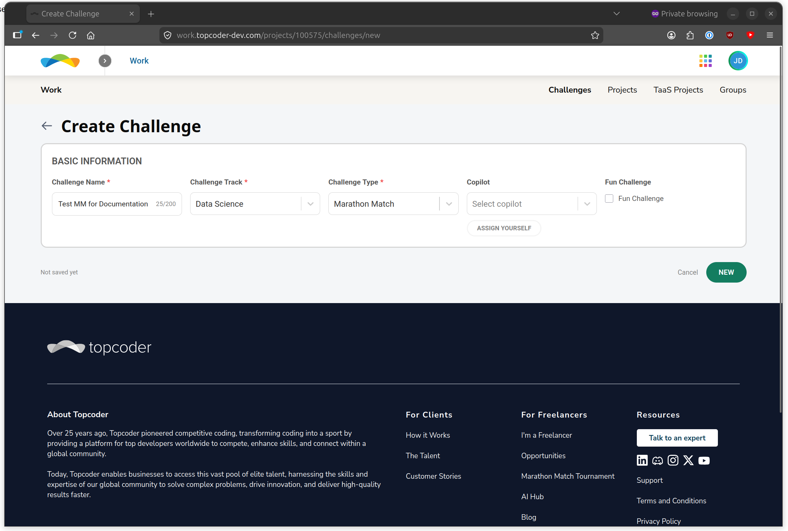
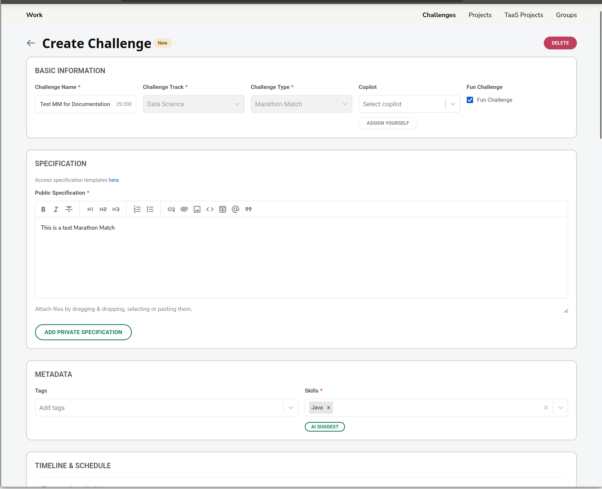
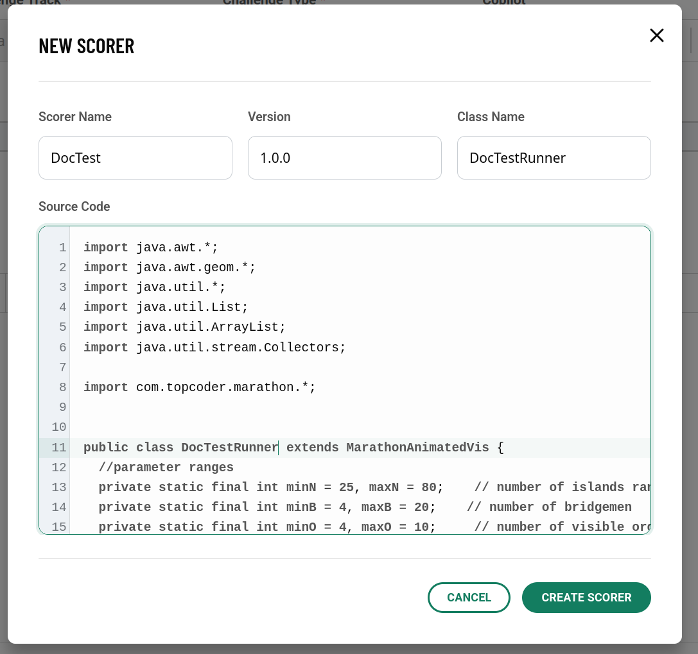
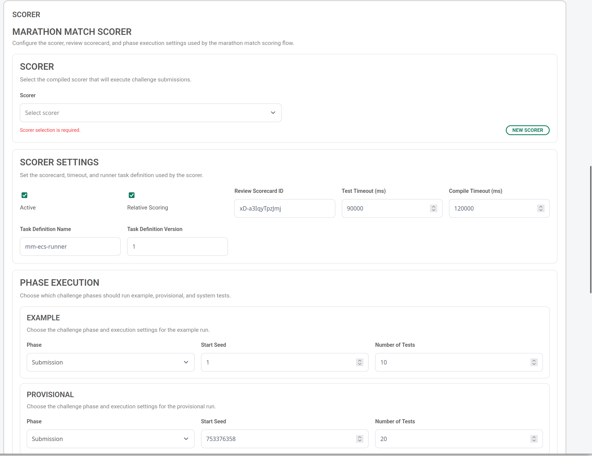
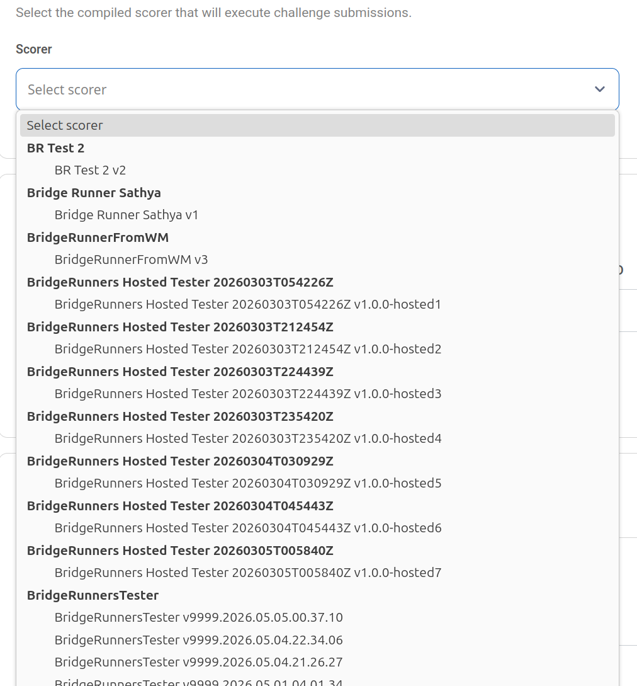
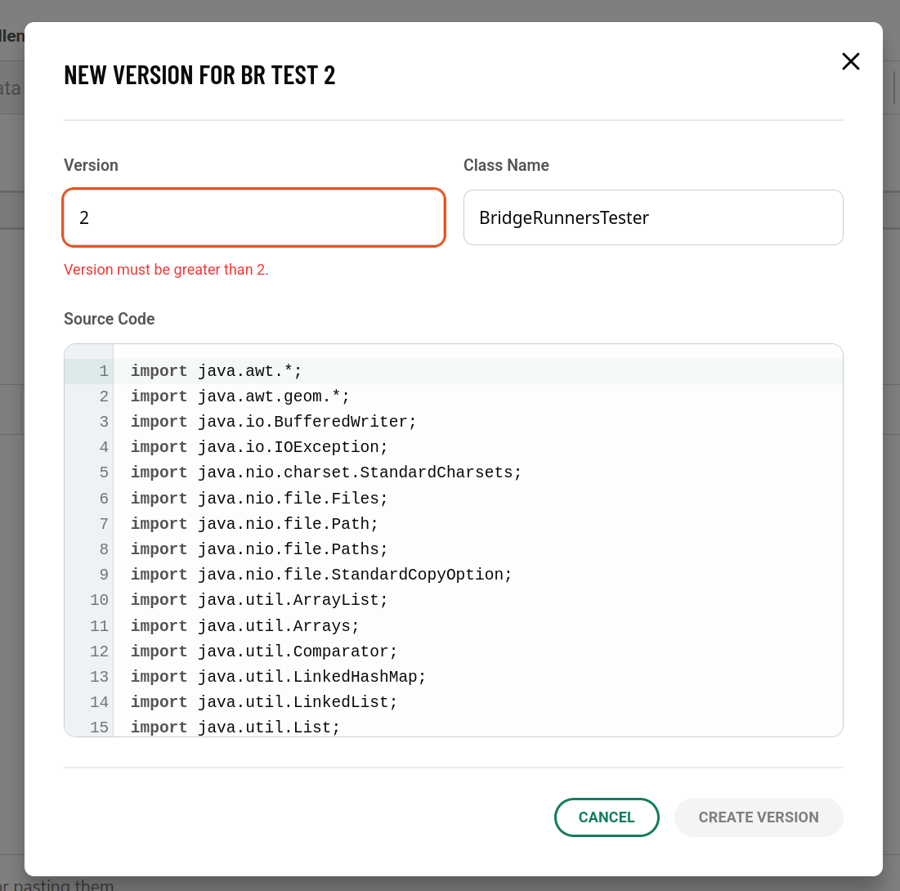
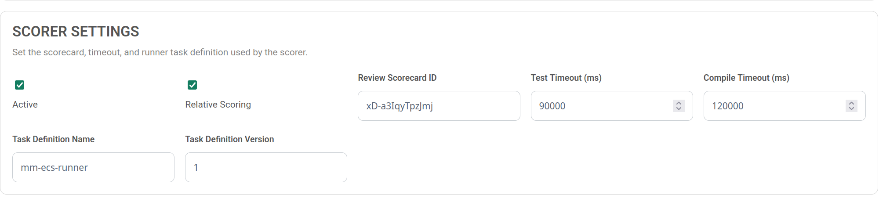
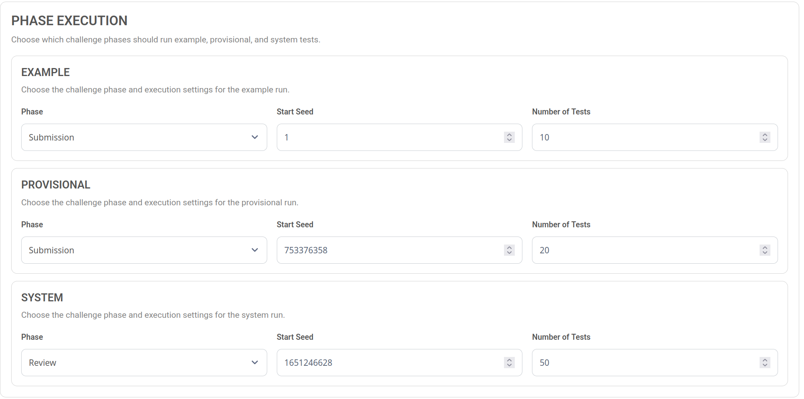
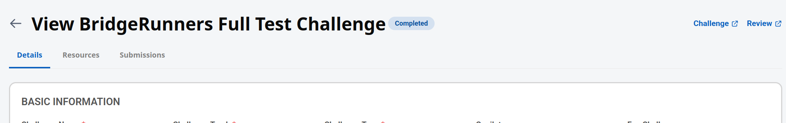

# Marathon Match Setup and Management

This guide documents how Marathon Match challenges are created and managed across the Work app and `marathon-match-api-v6`.

Use it for operator setup, tester updates, scoring reruns, and live submission monitoring. The lower-level API and runner references are:

- `marathon-match-setup.md`
- `submission-phase-scoring.md`
- `review-phase-scoring.md`
- `../ecs-runner/README.md`

## Access And Service Prerequisites

Before starting:

- You need Work app access for challenge creation/editing, as a copilot.  You should know the project and budget you have to work with.
- You need the `copilot` role for normal scorer/tester setup in the Work app.
- Manual reruns require administrator access, an M2M token with `update:marathon-match`, or the challenge's assigned `Copilot` resource.

## End-To-End Flow

1. Create a Marathon Match challenge in the Work app.
2. Save it as a draft so the challenge receives an ID and timeline phases.
3. Configure the Marathon Match scorer on the challenge details tab.
4. Choose an existing compiled scorer, create a new scorer version, or create a new scorer family.
5. Configure scorecard, relative scoring, timeouts, ECS task definition, and phase seed ranges.
6. Save the scorer config separately with `Save Scorer Config`.
7. Launch the challenge after the scorer config is saved and operationally ready.
8. Monitor submissions from the Work app Submissions tab, including score links, artifacts, and ECS runner logs.
9. If the tester changes during the challenge, publish a new version, update the scorer config, and rerun the latest submissions.

## Challenge Creation



In the Work app:

1. Open the project that owns the challenge.
2. Create a new challenge from the project challenge workflow.
3. Select the Data Science track and the `Marathon Match` challenge type.
4. If running a fun challenge, without a prize, click the `Fun Challenge` checkbox
4. Fill in the normal challenge fields: name, description, schedule, prizes, billing, copilot, terms, NDA, groups, and tags.  **MAKE SURE THE TIMELINE IS ACCURATE**
5. Fill in the tester details (see below)





## Scorer And Tester Concepts

The Work app calls the runnable tester a `Scorer`. The API stores it as a `tester`.

A tester/scorer record contains:

- `name`: tester family name shown in the scorer dropdown.
- `version`: version string. New versions must be greater than the current max version for the same tester family.
- `className`: Java class name for the tester entry point.
- `sourceCode`: Java tester source.
- `compilationStatus`: `PENDING`, `SUCCESS`, or `FAILED`.

Creating or versioning a tester triggers asynchronous compilation. The Work app refreshes a pending scorer every 5 seconds.

Do not launch a live challenge until the selected tester reports `compilationStatus = SUCCESS`. If compilation fails, read `compilationError`, fix the source, and publish another higher version.




## Setting Up The Tester




The scorer section appears on the challenge details tab .

### Using An Existing Tester




1. In `Marathon Match Scorer`, open the `Scorer` dropdown.
2. Choose the tester family and version. Versions are grouped by name.
3. Confirm the summary shows the expected selected scorer, compilation status, and main class.
4. Continue with scorer settings and phase execution.

Operational checks:

- Prefer a `SUCCESS` version.
- Confirm the tester name/version matches the challenge statement and expected scoring logic.
- If the selected tester is still `PENDING`, wait for compilation success before launch.


### Adding A New Version To An Existing Tester



Use this when the same tester family is being updated for a bug fix or scoring change.

1. Select the existing scorer in the `Scorer` dropdown.
2. Click `New Version`.
3. Enter a higher `Version`.
4. Confirm or update `Class Name`.
5. Paste the updated Java `Source Code`.
6. Click `Create Version`.
7. Wait for compilation to finish.
8. Save the scorer config so the challenge points at the new tester ID.

The app preserves older versions. The new version is a new tester record that inherits the existing family name.


### Adding A New Tester Entirely


Use this when the challenge uses a brand-new tester family.

1. Click `New Scorer`.
2. Enter `Scorer Name`.
3. Enter `Version`.
4. Enter `Class Name`.
5. Paste the Java `Source Code`.
6. Click `Create Scorer`.
7. Wait for compilation to reach `SUCCESS`.
8. Save the scorer config.

If the scorer already exists and you're just making updates, use the new version flow above.

## Scorer Settings



**NOTE:  This section is already filled with reasonable defaults.  You should only really need to validate that this looks OK and not normally make changes.**

The `Scorer Settings` section controls the persisted Marathon Match config for the challenge.

| Work app field | API field | Notes |
| --- | --- | --- |
| `Active` | `active` | New submission events are processed only when this is enabled. Keep inactive until ready if you are configuring early. |
| `Relative Scoring` | `relativeScoringEnabled` | Recomputes review scores against current best raw testcase scores from latest submissions. |
| `Review Scorecard ID` | `reviewScorecardId` | Review API scorecard ID or legacy scorecard ID. The API validates this before saving. |
| `Test Timeout (ms)` | `testTimeout` | Timeout for tester execution. |
| `Compile Timeout (ms)` | `compileTimeout` | Timeout for submission compilation inside the ECS runner. |
| `System Test Timeout (ms)` | `systemTestTimeout` | Total SYSTEM scoring timeout per submission. Defaults to 24 hours; timed-out SYSTEM tasks are stopped and failed with `metadata.timed_out = true`. |
| `Task Definition Name` | `taskDefinitionName` | ECS task definition family, for example `mm-ecs-runner`. |
| `Task Definition Version` | `taskDefinitionVersion` | ECS task definition revision to run. |

## Phase Execution And Seeds



The `Phase Execution` section has one card each for:

- `Example`
- `Provisional`
- `System`

Each card has:

- `Phase`: the challenge phase that should trigger this run.
- `Start Seed`: first seed used by the tester for this phase. The API stores it as PostgreSQL `BIGINT`; use decimal strings for large 64-bit seeds.
- `Number of Tests`: number of seeds/testcases to execute.

Recommended defaults currently used by the Work app are:

| Config | Default phase | Start seed | Number of tests |
| --- | --- | ---: | ---: |
| Example | Submission | `1` | `10` |
| Provisional | Submission | `753376358` | `20` |
| System | Review | `1651246628` | `50` |

**NOTE: The seeds should be set randomly for the provisional and system tests, by the copilot**

Example and Provisional can both point at the Submission phase. When a submission event arrives and multiple phase configs match the currently open phase, `marathon-match-api-v6` launches one ECS scorer task per matching config.

System scoring runs from the Review phase flow. Keep the System phase mapped to the Review phase unless the challenge timeline has a deliberate custom review/scoring phase.

Validation rules:

- `Start Seed` must be a non-negative 64-bit integer from `0` through `9223372036854775807`; send it as a decimal string to avoid JSON number precision loss.
- `Number of Tests` must be an integer greater than or equal to `1`.
- `Phase` should resolve to the canonical challenge `phaseId`.

## Relative Scoring

Relative scoring applies when:

- `Relative Scoring` is enabled on the scorer config.
- The ECS runner callback metadata includes `testScores`.

For each testcase, the API finds the best raw score among the latest scored submission for each member. `scoreDirection` controls whether the best raw score is the maximum or minimum value. The stored relative testcase score is normalized to `0..100`, with zero raw or zero best scores counted as `0` for `MAXIMIZE` challenges. For `MINIMIZE` challenges, a raw score of `0` tied with the best score of `0` receives `100`. The aggregate review score is the average of those relative testcase scores.

Implications:

- A new high-performing submission can change other competitors' relative scores.
- Rerunning after a tester update can change scores even when the submitted files did not change.
- Failed testcase scores are treated as `0` for relative scoring, and an all-failed run stores aggregate `-1`.

The Work app currently saves `MAXIMIZE` as the default score direction. Use API updates if a challenge requires `MINIMIZE` scoring and the UI does not expose that choice in the current build.

## ECS Task Definition

**NOTE - Under most circumstances, you won't need to worry about this, but there could be customer cases where we want to use a custom ECS image for scoring** 

The scorer config does not store an image URI directly. It stores `taskDefinitionName` and `taskDefinitionVersion`, and `marathon-match-api-v6` launches:

```text
<taskDefinitionName>:<taskDefinitionVersion>
```

The ECS task definition must:

- Use the image built from `marathon-match-api-v6/ecs-runner/Dockerfile`.
- Include the configured `ECS_CONTAINER_NAME`.
- Use CloudWatch `awslogs` configuration if operator runner logs should be visible from the Work app.
- Not override the container `user`; the image starts as root for trusted bootstrap and runs generic submitted solution commands through the separate non-root `scorer` user internally.
- Have network access for the trusted parent runner to call Marathon Match API, Submission API, and Review API.

The API service must be configured with:

- `AWS_REGION`
- `ECS_CLUSTER`
- `ECS_SUBNETS`
- `ECS_SECURITY_GROUPS`
- `ECS_CONTAINER_NAME`
- `MARATHON_MATCH_API_URL`
- `REVIEW_API_URL`
- `REVIEW_TYPE_ID`

At launch, the API injects container overrides including:

- `TESTER_CONFIG_ID`
- `SUBMISSION_ID`
- `ACCESS_TOKEN`
- `MARATHON_MATCH_API_URL`
- `REVIEW_TYPE_ID`
- `TEST_PHASE`
- `PHASE_CONFIG_TYPE`
- `PHASE_START_SEED` (decimal 64-bit integer string)
- `PHASE_NUMBER_OF_TESTS`
- `REVIEW_ID` for system-review callbacks when applicable

To publish a new runner image, build and push the ECR image from `marathon-match-api-v6`, register a new ECS task definition revision, then update the scorer config to the new revision.


## Challenge Editing And Draft Creation



After the draft exists, the challenge editor has these tabs:

- `Details`: challenge fields, schedule, advanced options, and the scorer setup.
- `Resources`: resource assignments.
- `Submissions`: live submission monitoring after submissions exist.

Important editing behavior:

- The challenge form save and the scorer config save are separate operations.
- Use `Save Challenge` or `Update Challenge` for ordinary challenge fields.
- Use `Save Scorer Config` for Marathon Match scoring settings.
- Launch is blocked when the scorer section reports unsaved changes or validation errors.
- If the challenge timeline is changed and phase IDs are recalculated, reopen the scorer section and verify the Example, Provisional, and System phase selections before launch.


## Saving And Launching

Checklist before launch:

1. Confirm the selected scorer has compiled successfully.
2. Confirm `Active` is enabled only when scoring should run.
3. Confirm Example, Provisional, and System phase mappings.
4. Confirm seeds and test counts.
5. Confirm task definition name and revision point to the intended ECS runner image.
6. Click `Save Scorer Config`.
7. Save the challenge if any ordinary challenge fields changed.
8. Launch the challenge.

The create/update request validates the challenge, tester, scorecard, start seeds, and phase IDs.

## Updating The Tester During A Challenge

Use this flow when the tester source changes after the challenge is active.

1. Open the challenge Details tab in the Work app.
2. In the scorer section, select the current scorer and click `New Version`.
3. Create the new version with the updated Java source.
4. Wait until compilation reaches `SUCCESS`.
5. Save the scorer config so the challenge points at the new tester ID.
6. Trigger a rerun of latest submissions using the `Rerun scores` button on the UI.
7. Monitor the rerun ECS tasks, runner logs, artifacts, and review scores.


Rerun behavior:

- Requires the challenge to be `ACTIVE`.
- Requires at least one open challenge phase.
- Requires the scorer config to be active.
- Requires the selected tester to be compiled successfully.
- Requires a `PROVISIONAL` phase config.
- Fetches `isLatest=true` submissions from Submission API.
- Queues one ECS task for the latest submission per member.
- Uses the current `PROVISIONAL` seeds and test count.

The response includes the queued submission IDs and ECS task IDs or per-submission errors. Because the standard rerun endpoint is provisional-oriented, coordinate separately if a late tester change also needs Review/System scores regenerated.

## Monitoring Submissions

In the Work app challenge page, open the `Submissions` tab.

The table shows:

- Username and email.
- Submission date.
- Initial/final score.
- Submission ID.
- Download and monitoring actions.

Useful controls:

- `Download All`: downloads all currently listed submissions when the user has download access.
- Handle/date/min-score filters: narrow the visible table.
- Score link: opens the Review app challenge details page for the relevant submission tab.
- Download submission action: downloads the submitted package.
- Download artifacts action: opens the artifact modal.
- View runner logs action: opens ECS runner logs for Marathon Match submissions.

Runner log visibility is limited to operators: administrators, project managers, and copilots. The action is shown only for challenges identified as Marathon Match by type, abbreviation, or tags.

## Monitoring Artifacts

Use the submission row's artifact action to open `Submission Artifacts`.

Artifact checks after scoring:

- Expected visualizer/output files are present.
- Artifact names match the tester output expectations.
- Failed submissions either have diagnostic artifacts or a clear runner-log failure.
- If no artifacts are present, inspect the ECS logs and the review summation metadata.
- During Provisional and System scoring, Review API exposes the active process in `reviewSummation.metadata.testProcess` (`provisional` or `system`), progress in `reviewSummation.metadata.testProgress` (`0` to `1`), and status in `reviewSummation.metadata.testStatus` (`IN PROGRESS`, `SUCCESS`, or `FAILED`) when metadata is requested.

## Monitoring ECS Runner Logs


Use the submission row's runner-log action to open `Runner Logs`.


The API uses the persisted `submissionRunnerLog` mapping that is created when an ECS task is launched. The response includes:

- Submission ID.
- Selected ECS task ARN.
- Task ID.
- Cluster.
- Container name.
- Task definition.
- Phase config type when available.
- CloudWatch log group and stream.
- CloudWatch console URL when resolvable.
- Log events.


If the Work app cannot load logs:

- Confirm the submission has already launched a scorer task.
- Confirm the task definition has an `awslogs` log configuration.
- Confirm the API service can describe the task definition and read CloudWatch logs.
- Confirm the caller has `read:marathon-match` access through role or scope.
- Use the CloudWatch console URL from API logs or the persisted mapping if direct Work app viewing fails.

## Operational Checklist

Before launch:

- Challenge is saved as draft and timeline phases are present.
- Scorer config exists and is saved.
- Selected scorer compilation status is `SUCCESS`.
- `Active` is set intentionally.
- Example and Provisional map to the intended submission phase.
- System maps to the intended review/system scoring phase.
- Seeds and test counts match the challenge statement.
- Relative scoring setting matches the challenge rules.
- Review scorecard ID resolves in Review API.
- ECS task definition revision points at the intended runner image.
- Kafka submission events are enabled and the service consumer is running.

During the challenge:

- Watch Submission tab scores and timestamps.
- Spot-check artifacts for early submissions.
- Open runner logs for failures, timeouts, compile errors, and missing output.
- If tester source changes, publish a new version and rerun latest submissions.

After submission closes:

- Confirm System scoring starts during Review.
- Confirm final review summations have `metadata.testProcess = system`, `metadata.testProgress = 1`, `metadata.testStatus = SUCCESS`, and aggregate scores present.
- Confirm artifacts and logs are retained for troubleshooting.
