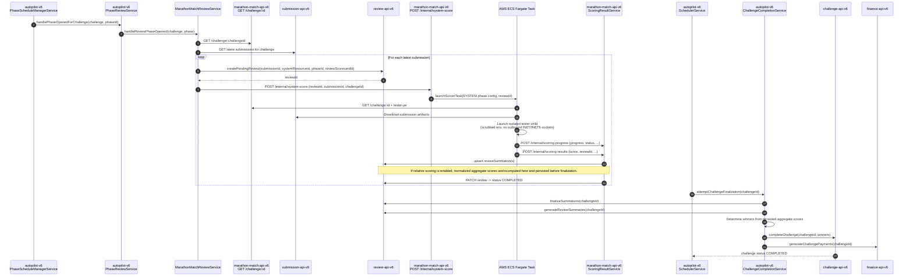

# Review Phase Scoring

## Overview

This document covers the Review-phase Marathon Match flow from the Submission phase closing and Review phase opening through payments being processed and the challenge being marked `COMPLETED`.

## Trigger

When the Review phase opens for a Marathon Match challenge, `autopilot-v6` routes the phase-open event through `PhaseReviewService.handlePhaseOpenedForChallenge(...)`. For Marathon Match review phases, that service delegates to `MarathonMatchReviewService.handleReviewPhaseOpened(...)`.

Manual phase changes are supported through the same path. If Review is opened directly in challenge-api, autopilot's challenge-update handling replays the phase-open work; startup recovery also replays already-open Review phases so missed update events still create and dispatch SYSTEM reviews.

Existing SYSTEM reviews can be restarted through `POST /v6/marathon-match/challenge/:challengeId/rerun/system`. This endpoint is intended for operator reruns after lowering timing settings or changing the tester while Review is open. It finds non-cancelled Review API reviews matching the challenge's configured Marathon Match scorecard, then dispatches SYSTEM scorer tasks with each existing `reviewId`.

## Flow

## System resource ID

`autopilot-v6` requires the `MARATHON_MATCH_SYSTEM_RESOURCE_ID` environment variable to create SYSTEM reviews in Review API. If it is missing, `MarathonMatchReviewService.handleReviewPhaseOpened` logs a warning, writes a `marathonMatch.handleReviewPhaseOpened` info entry through `AutopilotDbLoggerService`, and skips Marathon Match review setup for that challenge.

## Review completion

After `ScoringResultService` writes the SYSTEM review summation, `completeSystemReviewIfNeeded` patches the originating review to `COMPLETED` and writes the final score back to Review API.

While SYSTEM tests are running, the ECS runner updates the phase review summation metadata with `testProcess` (`provisional` or `system`), `testProgress` (`0` to `1`), and `testStatus` (`IN PROGRESS`, `SUCCESS`, or `FAILED`). These fields are returned by Review API under `reviewSummation.metadata` when metadata is requested. In-progress summations keep a neutral placeholder score and should be displayed as unavailable from `testStatus`; explicit failed progress uses the failed-score sentinel. Completed scoring can report `testStatus = SUCCESS` with nonzero `testProgressDetails.failedTests` when individual testcases timed out or crashed.

Each dispatched SYSTEM task also schedules a pg-boss timeout check using the config's `systemTestTimeout` value. The default is 24 hours (`86400000` ms). When the delayed check runs, the API describes the ECS task and checks the SYSTEM summation; if the task is still active and the summation is not complete, it stops the ECS task, writes a failed SYSTEM summation with score `-1`, and includes `metadata.timed_out = true`.

## ECS capacity back-pressure

Before each scorer launch, `EcsService.launchScorerTask(...)` enforces `ECS_SCORER_MAX_CONCURRENT_TASKS` across pending/running scorer tasks. During Review/SYSTEM dispatch, `ScoringResultService.triggerSystemScore(...)` catches that capacity-limit error and writes the review/submission/challenge tuple to the `system-score-dispatch` pg-boss queue. The HTTP request still returns accepted to autopilot, and `SystemScoreDispatchWorkerService` retries the queued dispatch until ECS capacity is available.

The queue is keyed by challenge ID, review ID, and submission ID so repeated phase-open recovery does not create duplicate queued work for the same SYSTEM review. Retry behavior is controlled by `SYSTEM_SCORE_DISPATCH_RETRY_DELAY_SECONDS` (default `300`), `SYSTEM_SCORE_DISPATCH_RETRY_LIMIT` (default `10000`), and `SYSTEM_SCORE_DISPATCH_WORKER_CONCURRENCY` (default `1`).

## Relative scoring at completion

If `relativeScoringEnabled = true`, `ScoringResultService` persists normalized aggregate scores to Review API before challenge finalization. `ChallengeCompletionService.finalizeChallenge(...)` consumes those persisted review summaries; it does not recompute relative scoring itself.

## Challenge finalization retries

After the review and downstream phases are closed, `SchedulerService` calls `attemptChallengeFinalization(...)`, which invokes `ChallengeCompletionService.finalizeChallenge(...)`. If review summaries are not ready yet, the scheduler retries with backoff until finalization succeeds or the retry limit is reached.

## Failure handling

`MarathonMatchReviewService.handleReviewPhaseOpened` catches and logs per-submission failures so one bad submission does not block the rest of the field. These actions are persisted through `AutopilotDbLoggerService`.

## Submission isolation

SYSTEM review scoring uses the same ECS runner isolation model as submission-phase scoring. The trusted parent runner process keeps the network access required for bootstrap and callback traffic, the tester executes in a scrubbed child JVM, and generic submitted solution commands run as the separate non-root `scorer` user with no outbound INET/INET6 socket access and no read access to infrastructure-revealing `/etc` and `/proc` paths.

## Observability

Primary places to inspect this flow:

- `dbLogger.logAction('marathonMatch.handleReviewPhaseOpened', ...)` entries in autopilot logging
- CloudWatch logs for the ECS scorer tasks launched for SYSTEM scoring
- marathon-match-api-v6 logs from `SystemScoreDispatchSchedulerService` and `SystemScoreDispatchWorkerService` when SYSTEM dispatch is deferred by ECS capacity
