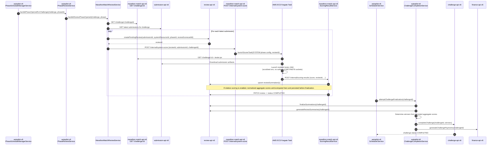

# Review Phase Scoring

## Overview

This document covers the Review-phase Marathon Match flow from the Submission phase closing and Review phase opening through payments being processed and the challenge being marked `COMPLETED`.

## Trigger

When the Review phase opens for a Marathon Match challenge, `autopilot-v6` routes the phase-open event through `PhaseReviewService.handlePhaseOpenedForChallenge(...)`. For Marathon Match review phases, that service delegates to `MarathonMatchReviewService.handleReviewPhaseOpened(...)`.

Manual phase changes are supported through the same path. If Review is opened directly in challenge-api, autopilot's challenge-update handling replays the phase-open work; startup recovery also replays already-open Review phases so missed update events still create and dispatch SYSTEM reviews.

## Flow

## System resource ID

`autopilot-v6` requires the `MARATHON_MATCH_SYSTEM_RESOURCE_ID` environment variable to create SYSTEM reviews in Review API. If it is missing, `MarathonMatchReviewService.handleReviewPhaseOpened` logs a warning, writes a `marathonMatch.handleReviewPhaseOpened` info entry through `AutopilotDbLoggerService`, and skips Marathon Match review setup for that challenge.

## Review completion

After `ScoringResultService` writes the SYSTEM review summation, `completeSystemReviewIfNeeded` patches the originating review to `COMPLETED` and writes the final score back to Review API.

## Relative scoring at completion

If `relativeScoringEnabled = true`, `ScoringResultService` persists normalized aggregate scores to Review API before challenge finalization. `ChallengeCompletionService.finalizeChallenge(...)` consumes those persisted review summaries; it does not recompute relative scoring itself.

## Challenge finalization retries

After the review and downstream phases are closed, `SchedulerService` calls `attemptChallengeFinalization(...)`, which invokes `ChallengeCompletionService.finalizeChallenge(...)`. If review summaries are not ready yet, the scheduler retries with backoff until finalization succeeds or the retry limit is reached.

## Failure handling

`MarathonMatchReviewService.handleReviewPhaseOpened` catches and logs per-submission failures so one bad submission does not block the rest of the field. These actions are persisted through `AutopilotDbLoggerService`.

## Submission isolation

SYSTEM review scoring uses the same ECS runner isolation model as submission-phase scoring. The trusted parent runner keeps the network access required for bootstrap and callback traffic, while the tester/submission executes in a separate `runner` child process with a scrubbed environment and no outbound INET/INET6 socket access.

## Observability

Primary places to inspect this flow:

- `dbLogger.logAction('marathonMatch.handleReviewPhaseOpened', ...)` entries in autopilot logging
- CloudWatch logs for the ECS scorer tasks launched for SYSTEM scoring
