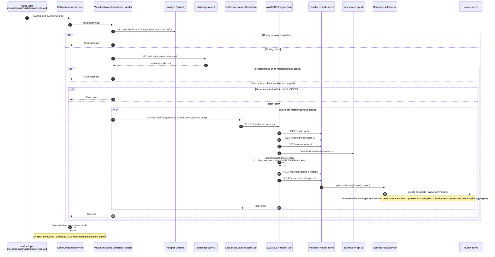

# Submission Phase Scoring

## Overview

This document covers the submission-phase scoring path from the `marathonmatch.submission.received` Kafka event through review summation writes in `review-api-v6`.

## Prerequisites / infrastructure checklist

Before enabling live scoring, confirm:

- Kafka topic `marathonmatch.submission.received` exists and is receiving events
- ECS cluster and task definition are available for the scorer runner
- `marathon-match-api-v6` environment variables are configured for Kafka, ECS, Challenge API, Review API, and Marathon Match API URLs
- M2M credentials are configured so the service and ECS runner can call downstream APIs

## Flow

## Retry and DLQ behavior

Kafka consumption retries with exponential backoff. When `KAFKA_DLQ_ENABLED=true`, messages that still fail after `KAFKA_DLQ_MAX_RETRIES` are published to the configured DLQ topic suffix and the original offset is committed.

## Submission network isolation

The ECS task keeps trusted network access only on the trusted parent runner process so it can fetch config, download the submission, upload artifacts, and post the callback. The tester runs inside a scrubbed child JVM, while generic submitted solution commands run as the separate non-root `scorer` user with:

- a scrubbed environment that does not include `ACCESS_TOKEN`
- socket creation limited to `AF_UNIX`, which prevents live outbound network connections from the submission itself
- root-only tester JAR and scorer config files, preventing submitted code from reading those `/tmp` inputs
- callback review payloads created by the trusted runner's generic Marathon flow, or by a custom tester `runTester(...)` result map when a tester opts into that advanced path

## Observability

Runner task logs are written to CloudWatch using the submission runner log stream. Operators can also inspect runner output through:

`GET /v6/marathon-match/submissions/:submissionId/runner-logs`

For `PROVISIONAL` scoring, the runner writes progress to the phase review summation metadata through `POST /v6/marathon-match/internal/scoring-progress`. Review API exposes this as `reviewSummation.metadata.testProcess` (`provisional` or `system`), `reviewSummation.metadata.testProgress` (`0` to `1`), and `reviewSummation.metadata.testStatus` (`IN PROGRESS`, `SUCCESS`, or `FAILED`) when metadata is included in the response.

When more than one phase config matches the currently open challenge phases, the handler launches one scorer task per match. This is the supported way to run both `EXAMPLE` and `PROVISIONAL` scoring from the same Submission phase.

## Relative scoring

Relative scoring applies when:

- `relativeScoringEnabled = true` on the Marathon Match config
- `testScores` are present in the scorer metadata

In that case, `ScoringResultService` recalculates the latest-submission review scores relative to the current best result before writing review summations, so the persisted aggregate score stays normalized against the live field.

## Tester-change rerun

Use:

`POST /v6/marathon-match/challenge/:challengeId/rerun`

This endpoint selects the latest submission for each member in received order and launches ECS scorer tasks in parallel using the challenge's `PROVISIONAL` phase config. Use it after changing the tester or when current latest submissions need to be rescored without waiting for new submission events.

Rerun access is limited to admins, M2M tokens with `update:marathon-match`, and the `Copilot` resource assigned to the challenge.
