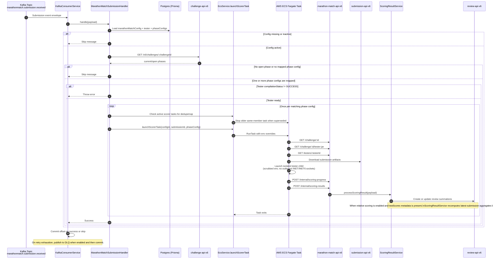

# Submission Phase Scoring

## Overview

This document covers the submission-phase scoring path from the `marathonmatch.submission.received` Kafka event through review summation writes in `review-api-v6`.

## Prerequisites / infrastructure checklist

Before enabling live scoring, confirm:

- Kafka topic `marathonmatch.submission.received` exists and is receiving events
- ECS cluster and task definition are available for the scorer runner
- `marathon-match-api-v6` environment variables are configured for Kafka, ECS, Challenge API, Review API, and Marathon Match API URLs
- M2M credentials are configured so the service and ECS runner can call downstream APIs

## Flow

## Retry and DLQ behavior

Kafka consumption retries with exponential backoff. When `KAFKA_DLQ_ENABLED=true`, messages that still fail after `KAFKA_DLQ_MAX_RETRIES` are published to the configured DLQ topic suffix and the original offset is committed.

## Scorer task launch limits

Before each `RunTask`, `EcsService.launchScorerTask(...)` lists pending/running scorer tasks for the configured ECS task family. It skips duplicate active launches for the same challenge, submission, and phase config type; stops older active tasks for the same challenge/member when a newer submission arrives; and enforces `ECS_SCORER_MAX_CONCURRENT_TASKS` before launching another task. The cap defaults to `20`.

When the cap is reached, the handler throws before calling `RunTask`. Kafka retry/backoff then provides back-pressure instead of committing the offset and creating unbounded ECS work.

## Submission network isolation

The ECS task keeps trusted network access only on the trusted parent runner process so it can fetch config, download the submission, upload artifacts, and post the callback. The tester runs inside a scrubbed child JVM, while generic submitted solution commands run as the separate non-root `scorer` user with:

- a scrubbed environment that does not include `ACCESS_TOKEN`
- socket creation limited to `AF_UNIX`, which prevents live outbound network connections from the submission itself
- a filesystem allowlist that permits runtime/toolchain reads and scorer temp writes without exposing `/etc/hostname`, `/etc/resolv.conf`, `/proc/self/cgroup`, `/proc/self/mounts`, or proc network tables
- runner-owned mode `0400` tester JAR files, preventing submitted code from reading or modifying those `/tmp` inputs
- a runner-owned mode `0400` scorer config handoff file that is deleted before tester or submitted solution code executes
- callback review payloads created by the trusted runner's generic Marathon flow, or by a custom tester `runTester(...)` result map when a tester opts into that advanced path

## Observability

Runner task logs are written to CloudWatch using the submission runner log stream. Operators can also inspect runner output through:

`GET /v6/marathon-match/submissions/:submissionId/runner-logs`

For `PROVISIONAL` and `SYSTEM` scoring, the runner writes progress to the phase review summation metadata through `POST /v6/marathon-match/internal/scoring-progress`. Review API exposes this as `reviewSummation.metadata.testProcess` (`provisional` or `system`), `reviewSummation.metadata.testProgress` (`0` to `1`), and `reviewSummation.metadata.testStatus` (`IN PROGRESS`, `SUCCESS`, or `FAILED`) when metadata is included in the response. In-progress summations keep a neutral placeholder score and must be rendered as unavailable based on `testStatus`; only `FAILED` progress uses the failed-score sentinel. SYSTEM timeout failures also include `reviewSummation.metadata.timed_out = true`.

For generic runner artifacts, only EXAMPLE scoring uploads the member-visible public artifact. Its public `output.txt` starts with the captured compilation output, then includes each testcase ordinal, actual seed, seed score, runtime, runner/tester errors, and submitted-solution stderr, while submitted-solution stdout stays private. Every generic scoring phase uploads private internal artifacts: `reviews.json` includes `compilationOutput`, per-test score details with testcase ordinals and actual seeds, and top-level `testScores`; callback metadata keeps member-visible testcase ordinals only, compile and execution logs are preserved as `compile_log.txt`, `execution-{submissionId}.log`, and optional `error-{submissionId}.log`, and captured submitted-solution output is split into `stdout/{seed}.txt` and `stderr/{seed}.txt` files for each actual seed. PROVISIONAL and SYSTEM scoring do not publish competitor-visible artifacts.

When more than one phase config matches the currently open challenge phases, the handler launches one scorer task per match. This is the supported way to run both `EXAMPLE` and `PROVISIONAL` scoring from the same Submission phase.

## Relative scoring

Relative scoring applies when:

- `relativeScoringEnabled = true` on the Marathon Match config
- `testScores` are present in the scorer metadata

In that case, `ScoringResultService` recalculates the latest-submission review scores relative to the current best result before writing review summations, so the persisted aggregate score stays normalized against the live field. Recalculated impacted submissions keep their existing `reviewedDate` so relative-score updates do not move historical review timestamps.

## Tester-change rerun

Use:

`POST /v6/marathon-match/challenge/:challengeId/rerun`

This endpoint selects the latest submission for each member in received order and launches ECS scorer tasks in parallel for every scorer config that matches the currently open challenge phase. During Submission this normally includes both `EXAMPLE` and `PROVISIONAL` when they are mapped to the Submission phase. It is also triggered automatically after an active challenge's `testerId` changes, and can be called manually when current latest submissions need to be rescored without waiting for new submission events.

For Review/System scoring reruns, use:

`POST /v6/marathon-match/challenge/:challengeId/rerun/system`

The SYSTEM rerun endpoint restarts existing non-cancelled Review API reviews that match the challenge's configured Marathon Match review scorecard and passes each existing `reviewId` into the SYSTEM scorer.

Rerun access is limited to admins, M2M tokens with `update:marathon-match`, and the `Copilot` resource assigned to the challenge.
